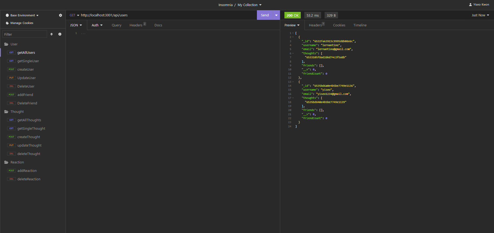
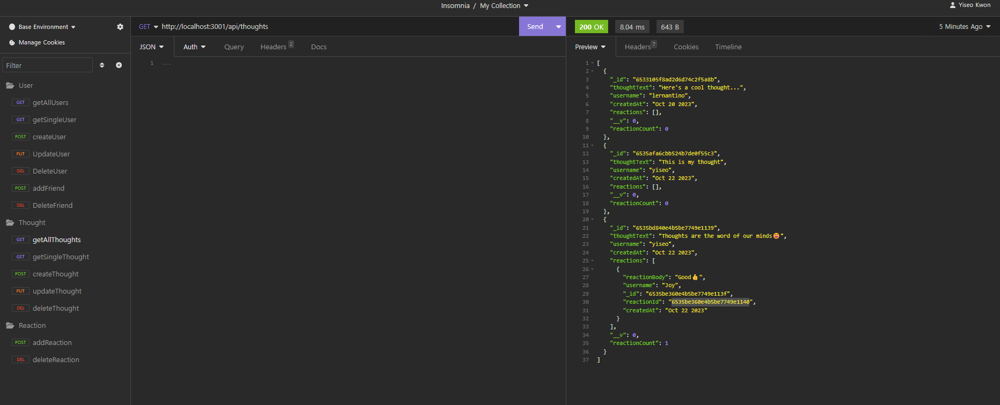
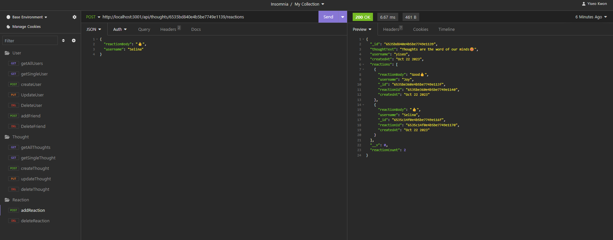

# NoSQL Social Network API
 

## Description
This is a RESTful API for a social network web application that allows users to share their thoughts, react to friends' thoughts, and create a friend list. It's built using Express.js and MongoDB with Mongoose.

## User Story
```
AS A social media startup
I WANT an API for my social network that uses a NoSQL database
SO THAT my website can handle large amounts of unstructured data
```

## Acceptance Criteria
```
GIVEN a social network API
WHEN I enter the command to invoke the application
THEN my server is started and the Mongoose models are synced to the MongoDB database
WHEN I open API GET routes in Insomnia for users and thoughts
THEN the data for each of these routes is displayed in a formatted JSON
WHEN I test API POST, PUT, and DELETE routes in Insomnia
THEN I am able to successfully create, update, and delete users and thoughts in my database
WHEN I test API POST and DELETE routes in Insomnia
THEN I am able to successfully create and delete reactions to thoughts and add and remove friends to a user’s friend list
```

## Installation
1. Clone this repository to your local machine
2. Navigate to the repository's root directory
3. Install the required dependencies by running: `npm install`
4. Start the server: `npm start`

## Usage
To interact with the API, you can use a tool like Insomnia

## Technologies Used
This social network API was built using the following technologies and tools:

- [Node.js](https://nodejs.org/): A JavaScript runtime for server-side development.
- [Express.js](https://expressjs.com/): A fast, unopinionated, and minimalist web framework for Node.js.
- [MongoDB](https://www.mongodb.com/): A NoSQL database used to store data.
- [Mongoose](https://mongoosejs.com/): A MongoDB object modeling tool for Node.js.
- [date-and-time](https://www.npmjs.com/package/date-and-time): A JavaScript library for formatting timestamps.

## License
This project is licensed under the MIT license - see the [MIT License](https://opensource.org/licenses/MIT) file for details.

## Screenshot
**Insomnia GET all users test:**


**Insomnia GET all thoughts test:**


**Insomnia POST reaction test:**
